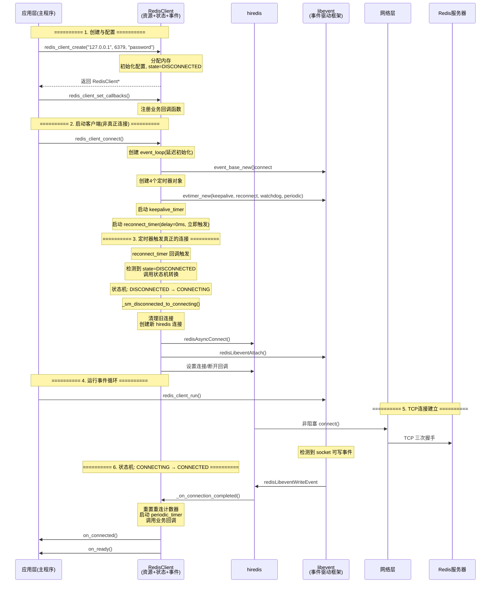

```mermaid
sequenceDiagram
    participant App as 应用层(主程序)
    participant RC as RedisClient<br/>(资源+状态+事件)
    participant Hiredis as hiredis
    participant Libevent as libevent<br/>(事件驱动框架)
    participant Net as 网络层
    participant Redis as Redis服务器

    Note over App,RC: ========== 1. 创建与配置 ==========
    App->>RC: redis_client_create("127.0.0.1", 6379, "password")
    Note over RC: 分配内存<br/>初始化配置, state=DISCONNECTED
    RC-->>App: 返回 RedisClient*
    App->>RC: redis_client_set_callbacks()
    Note over RC: 注册业务回调函数

    Note over App,RC: ========== 2. 启动客户端(非真正连接) ==========
    App->>RC: redis_client_connect()
    Note over RC: 创建 event_loop(延迟初始化)
    RC->>Libevent: event_base_new()connect
    Note over RC: 创建4个定时器对象
    RC->>Libevent: evtimer_new(keepalive, reconnect, watchdog, periodic)
    Note over RC: 启动 keepalive_timer
    Note over RC: 启动 reconnect_timer(delay=0ms, 立即触发)
    
    Note over RC: ========== 3. 定时器触发真正的连接 ==========
    Note over RC: reconnect_timer 回调触发
    Note over RC: 检测到 state=DISCONNECTED<br/>调用状态机转换
    Note over RC: 状态机: DISCONNECTED → CONNECTING
    Note over RC: _sm_disconnected_to_connecting()
    Note over RC: 清理旧连接<br/>创建新 hiredis 连接
    RC->>Hiredis: redisAsyncConnect()
    RC->>Libevent: redisLibeventAttach()
    RC->>Hiredis: 设置连接/断开回调

    Note over App,RC: ========== 4. 运行事件循环 ==========
    App->>Libevent: redis_client_run()

    Note over Net,Redis: ========== 5. TCP连接建立 ==========
    Hiredis->>Net: 非阻塞 connect()
    Net->>Redis: TCP 三次握手
    Note over Libevent: 检测到 socket 可写事件

    Note over RC: ========== 6. 状态机: CONNECTING → CONNECTED ==========
    Libevent->>Hiredis: redisLibeventWriteEvent
    Hiredis->>RC: _on_connection_completed()
    Note over RC: 重置重连计数器<br/>启动 periodic_timer<br/>调用业务回调
    RC->>App: on_connected()
    RC->>App: on_ready()

```